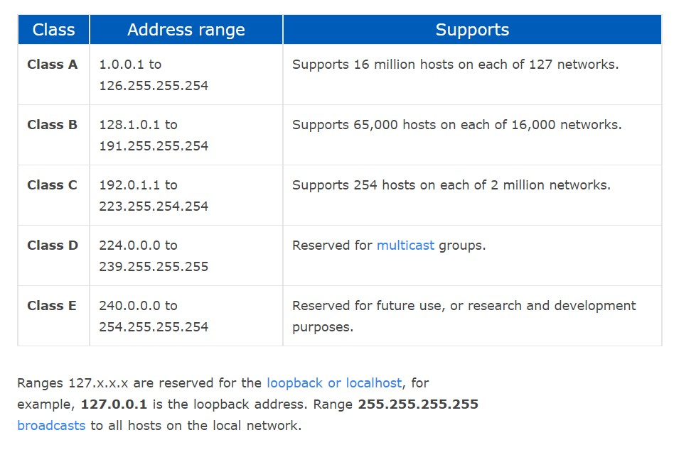

# Networking

## What is a network?
- A network is really just two or more computers linked to each other via cables, Wi-Fi etc.

- Network topology describes the relationship of connected devices in terms of a geometric graph
    - A mesh topology describes a network where all computers in it are connected to it

- An example of a network is the Internet

 

## What is an IP?
- IP stands for 'Internet Protocol'. An IP address is a label assigned to every device connected to a network that uses the Internet Protocol to communicate.

- Each IP address must be unique in its own network. Networks can be isolated from one another and they can be bridged and translated to provide access between distinct networks.

 

## What is IPv4?
- It is the fourth version of the IP. It uses a 32-bit address space (where a bit is a binary digit). Each number in an IPv4 adress is characterised by 8 bits, and there are four of them (hence 32).

- An example of an IPv4 address is 192.168.35.1 (in decimal) or 11000000.10101000.00100011.00000001 (in binary). In the binary representation, you can see that there are 8 bits per value.

 

## Calculating IP in binary
- To convert an IP address to binary, you would literally just need to convert each value to binary while ensuring you represent each fully in 8 bits.

- For example, if you were to find 1 in binary is also 1 but in an IP address you would need to write 00000001 to ensure there are 8 bits.

 

## How do you calculate the maximum number of IPv4 addresses? Is this maximum number a problem?
- IP addresses take values 0-255 and there are a total of four of them. Essentially, there are 256 ways to choose the first one, the second one, the third one and the fourth one. Hence there are a total of 256^4 choices of addresses.

- Every node of an IP network is assigned a unique code that allows them to be identified. As there are not even 5 billion possible addresses, there will soon be no space for further machines on the Internet.

 

## IPv4 vs. IPv6
- IPv6 is a newer version to the Internet Protocol. Just like IPv4, it provides machines the unique addresses necessary for Internet-enabled devices to communicate.

- Unlike IPv4, however, there are 1028 more unique combinations allowing for a total of 2^128 possible unique addresses. This is achieved by using 128-bit Internet addresses as opposed to the 32-bit addresses that IPv6 uses.

 

## What is a DOS Attack and how might you stop it?
- DOS stands for 'Denial-of-Service'. It is an attack meant to shut down a machine or network. It accomplishes this through flooding the target with traffid or sending information that will trigger a crash.

- A `buffer overflow attack` is the most common. It is achieved by sending in more traffic than the server/network can handle.

- A DDoS attack occurs when multiple systems attempt to synchronise a DoS attack. DDoS stands for 'Distributed Denial-of-Service'. In essence, instead of a network being attacked from one location, it is being attacked from many locations at once.

- One way to deal with it is to simply add more bandwidth than the server will ever need. Another way is to also limit the number of addresses that can actually connect to the server (through security groups etc.). A further way to deal with it is to inspect the traffic that is incoming and drop packets of IP addresses that are possibly attempting a DoS attack.

 

## What is NAT?
- NAT stands for 'Network Address Translation'. It enables private IP networks that use unregistered IP addresses to connect to the Internet. Typically operating in routers, they connect two networks together and translates the private (not globally unique) addresses in the internal network into legal addresses before packets are forwarded to another network.

- A NAT allows a single device (such as a router) to act as an agent between the Internet( the public network) and a local network, thus allowing a single globally unique IP address to represent a group of computers.

 

## Address classes
- IPs consist of the Network Prefix (ID) and the Host ID. There are 5 classes of IP's:

    

- Class A

    **0—** : If the first bit of an IPv4 address is “0”, this means that the address is part of class A. This means that any address from 0.0.0.0 to 127.255.255.255 is in class A.

- Class B

    **10–** : Class B includes any address from 128.0.0.0 to 191.255.255.255. This represents the addresses that have a “1” for their first bit, but don’t have a “1” for their second bit.

- Class C

    **110-** : Class C is defined as the addresses ranging from 192.0.0.0 to 223.255.255.255. This represents all of the addresses with a “1” for their first two bits, but without a “1” for their third bit.

- Class D

    **1110** : This class includes addresses that have “111” as their first three bits, but a “0” for the next bit. This address range includes addresses from 224.0.0.0 to 239.255.255.255.
- Class E

    **1111** : This class defines addresses between 240.0.0.0 and 255.255.255.255. Any address that begins with four “1” bits is included in this class.

- Network and Host parts:
    1. Class A addresses use the remainder of the first octet to represent the network and the remaining 3 octets for the host
    2. Class B addresses use the first two octets to define the network while the rest is used to define the host
    3. Class C addresses use the first three octets to define the network and the last octet to define the host

 

## Netmasks
- A netmask is a specification of the amount of address bits that are used for the network portion.

- Each bit of the address that is considered significant for describing the network should be represented as a "1" in the netmask.

- Example:
    - In Class C addresses, the first three octets represent the network ID (which are significant bits) and we want to preserve these so the netmask would be `11111111 - 11111111 - 11111111 - 00000000` or simply just `255.255.255.0`
    - Any bit in that is 0 in the binary representation is part of the host ID which can vary while the bits that are 1 are static

 

## Example 
- We will examine the following address `192.168.0.15`
    - Written in binary this is: `1100 0000 - 1010 1000 - 0000 0000 - 0000 1111`
    - This is a Class C address, as described above

- The network portion for Class C addresses are the first three octets, and since these are significant bits they need to be all 1's. 
    - Basically, the netmask for Class C should be `1111 1111 - 1111 1111 - 1111 1111 - 0000 0000`
    - In decimal this is `255.255.255.0`
    - Any bit that is a 0 is considered part of the host address

- We determine the network portion of the address by applying a bitwise AND operation between the address and the netmask (basically AND returns 1 only if both the mask and address are 1 in that bit)
    1. `1111 1111 - 1111 1111 - 1111 1111 - 0000 0000`
    2. `1100 0000 - 1010 1000 - 0000 0000 - 0000 1111`
    
- After applying the operation we end up with the following network portion of the address:
    - `1100 0000 - 1010 1000 - 0000 0000 - 0000 0000`
    - Or `192.168.0.0` in decimal

- The host specification is then the difference between the original value and the host 
portion.
    - The host case here is then `0000 1111` or `15`

- Moving onto a subnets, we can use one bit of this host as a subnet mask
    - We can do so by adjusting the subnet mask from:
    1. `1111 1111 - 1111 1111 - 1111 1111 - 0000 0000` to...
    2. `1111 1111 - 1111 1111 - 1111 1111 - 1000 0000` or...
    3. `192.168.0.128`

- In decimal notation this is `192.168.0.128`. What we have done is designate the first bit of the last octet as significant in addressing the network.

- This effectively produces two subnetworks:
    1. `192.168.0.1` to `192.168.0.127`
    2. `192.168.0.129` to `192.168.0.255`
> Why not `192.168.0.128`? Well, traditionally the subnet itself must not be used as an address

- Using CIDR, we can express the IP address `192.168.0.15` which has the netmask `255.255.255.0` as `192.168.0.15/24`
    - The `24` bit indicates that the first 24 bits are significant for network routing

 

## What are subnets?
- It stands for a subnetwork -- a network located within a network. By default, each network has only 1 subnet containing all of the host addresses defined within.

- Subnetting is the idea of taking a portion of this host portion and using it as an additional networking specification to divide the address space again

- A subnet mask is another netmask within used to further divide the network

- For example, a netmask of `255.255.255.0` leaves us with 254 hosts in the network (since 0 and 255 at the end are reserved addresses)
    - If we wanted to divide this into two subnets, we could use one bit of the host as a subnet mask (look in the example above)

 

## CIDR Blocks
- This stands for 'Classless Inter-Domain Routing'. It's a method for allocating IP addressses and for IP routing. It was used to replace the classful network addressing architecture on the Internet.

- CIDR is based on variable-length subnet masking (VLSM). This allows it to define prefixes of arbitrary lengths making it much more efficient than the old system.

- CIDR numbers are made up of two things:
    1. The network address
    2. A suffix that indicates how many bits are in the address

- An example of a CIDR number is `192.255.255.255/12`
    - The left part is the usual IP address
    - The right part indicates how many bits are significant in identifying the network

 

## Are two addresses in the same network?
- Subnets are all about creating commonalities. For example, `201.105.7.34/24` is in the same network as `201.105.7.1/24` -- this is because both of their first 24 bits are the same value.

- How about `192.168.200.5/30` and `192.168.200.9/30`?
    - This one is a bit more difficult to see as the network address goes into the final octet.

- Let's first find the network ID for the first one.
    > Note that it is `1100 0000 - 1010 1000 - 1100 1000 - 0000 0101` in binary
    - The netmask can be found by looking at the `/30` -- the first 30 bits are significant and in binary the first 30 will then be 1's
    > The mask is hence `1111 1111 - 1111 1111 - 1111 1111 - 1111 1100`
    - We now apply bitwise AND operation on both:
    1. `1100 0000 - 1010 1000 - 1100 1000 - 0000 0101`
    2. `1111 1111 - 1111 1111 - 1111 1111 - 1111 1100`

    - We get that the network ID is:
    1. `1100 0000 - 1010 1000 - 1100 1000 - 0000 0100` or in decimal...
    2. `192.168.200.4`
    
- Now for the second one:
    > `1100 0000 - 1010 1000 - 1100 1000 - 0000 1001` in binary
    
    > `1111 1111 - 1111 1111 - 1111 1111 - 1111 1100` as the netmask
    - Doing the bitwise operation on this one yields the required network ID:
    > `1100 0000 - 1010 1000 - 1100 1000 - 0000 1000` or in decimal...

    > `192.168.200.8`

- As you can see, they do not have the same network ID and are hence not in the same network.

 

## TCP
- This stands for 'Transmission Control Protocol'. It facilitates the exchange of messanges between devides in a network. It is the most common protocol in networks that use the IP.
    - What's the difference? IP is the part the obtains the address to which data is sent while TCP is responsible for the data delivery (once the IP address has been found)

- TCP breaks each message into `packets` and those packets are re-assembled on the other end. Each packet could even take a different route to each other.

- TCP also divides the different communications into `layers` with each layer having a different function. Data goes through four different layers before it is received. The purpose of these layers is to standardise everything (this makes it so every company, software developer etc. must follow this universal communication system)

- The four layers are the following:
    1. `Datalink layer` handles the actual physical aspect of sending and receiving data
    2. `Internet layer` controls the movement of packets around the network
    3. `Transport layer` provides a reliable data connection between two devices. This divides data into packets, acknowledges the packets that it has received from the other device and makes sure that the other device acknowledges the packets it receives.
    4. `Application layer` is the group of apps that require network communication. This is what the actual user interacts with (email, messaging etc.). The lower layers handle the details of communication so the applications don't need to concern themselves with building those parts.

 

## OSI model and layers
- OSI stands for 'Open Systems Interconnection'. The OSI model is a conceptual framework used to describe the functions of a networking system. There are 7 different layers:
    1. Physical layer
    2. Data Link layer
    3. Network layer
    4. Transport layer
    5. Session layer
    6. Presentation layer
    7. Application layer

 

## What is a VPN?
- VPN stands for `Virtual Private Network`. It aims to provide privacy and anonymity by creating a private network from a public internet connection.

- When you browse the internet, your computer will contact websites through the encrypted VPN connection. The VPN will forward your request on you behalf and it will then forward the response back to you securely.

 

## What is a malicious IP and how can we stop one?
- Malicious IP's are those deemed to be potentially dangerous or "bad" (for lack of a better term)

- These IP's could gain that reputation by potentially being known to spend spam, being associated with the sending of malware, being associated with adware etc.

- To protect yourself from such IP's you can use, for example, firewalls

 

---
**Used:**
- [IP's, classes, subnets, CIDR](https://www.digitalocean.com/community/tutorials/understanding-ip-addresses-subnets-and-cidr-notation-for-networking)

- [TCP/IP](https://www.avast.com/c-what-is-tcp-ip)